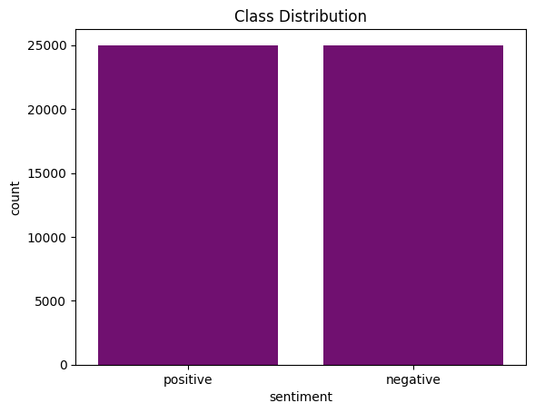
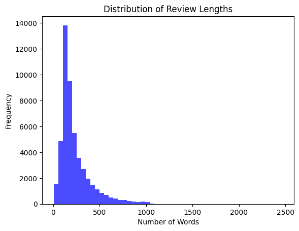
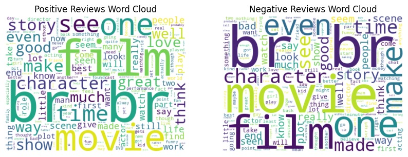
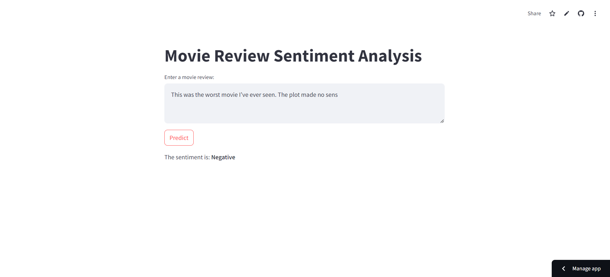

# Sentiment Analysis App

This project involves building a web application for Sentiment Analysis on movie reviews using machine learning. The application utilizes a Logistic Regression model and a TfidfVectorizer to classify reviews as Positive or Negative. It has been deployed on Streamlit Cloud, allowing users to interact with the model in real-time.

# Features

- Input: Users can enter a movie review.

- Output: The app predicts the sentiment as either Positive or Negative.

- Deployed: Hosted on Streamlit Cloud for easy accessibility.

# Data Exploration
1. Class Distribution:
   

The dataset is balanced with an equal number of positive and negative reviews (~25,000 each), ensuring that the model isn't biased toward any specific class.
2. Distribution of Review Lengths:
  
The majority of reviews have fewer than 500 words, with a small tail extending to longer reviews (up to ~2,500 words). This distribution highlights the varying levels of detail in the dataset.

3. Word Clouds for Positive and Negative Reviews:

The Positive Word Cloud emphasizes words like "film," "good," and "great," reflecting positive sentiments.
The Negative Word Cloud shows words like "bad," "film," and "time," commonly associated with negative sentiments.

# Technologies Used

**Python Libraries**:

- scikit-learn: For training and evaluating machine learning models.

- Streamlit: For creating the web application interface.

- joblib: For saving and loading the trained model and vectorizer.

- numpy: For numerical computations.

**Vectorizers**:

1. TfidfVectorizer:

Converts text data into numerical features using term frequency-inverse document frequency.

Used for the main model due to its better handling of importance weighting.

2. CountVectorizer:

Converts text data into numerical features based on word counts.

Used for experimentation but not selected for deployment.

# Observations

**Logistic Regression**

- Accuracy: Achieves the highest accuracy (0.8948).

- Performance: Balanced precision, recall, and f1-score for both classes.

- Suitability: Best suited for this problem due to its simplicity and effectiveness unless interpretability or scalability becomes a concern.

**Random Forest**

- Accuracy: Good accuracy (0.8657), but slightly lower than Logistic Regression.

- Challenges: Computationally expensive due to multiple estimators.

- Suitability: A powerful model but not as efficient for this task compared to Logistic Regression.

**Naive Bayes**

- Accuracy: Simplest model with decent performance (0.8652).

- Limitations: Lower recall for the positive class compared to Logistic Regression.

- Suitability: A lightweight and fast option, but not the best performer for this dataset.

# Deployment

**Steps for Deployment on Streamlit Cloud**:

**Model Training**:

Trained a Logistic Regression model using a TfidfVectorizer on the IMDB dataset of 50K movie reviews.

Achieved high accuracy and balanced performance.

**Saved Artifacts**:

The trained model (logistic_regression_model.pkl).

The TfidfVectorizer (tfidf_vectorizer.pkl).

**Created the Application**:

Developed the app using Streamlit to provide a user-friendly interface.

**Deployment**:

Connected the repository to Streamlit Cloud.

Deployed the app, making it accessible at: Sentiment Analysis App.

# Conclusion

This Sentiment Analysis app demonstrates the effective use of machine learning and deployment technologies to create a practical and user-friendly solution. By leveraging Logistic Regression and TfidfVectorizer, the app achieves high accuracy and showcases technical and deployment skills for real-world applications.

# Deployed Link

Access the app here: https://sentiment-analysis-qpamtasm6uwd9jenprgiqy.streamlit.app/

